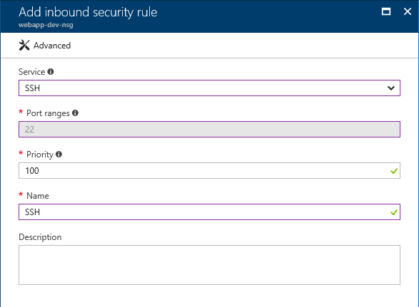
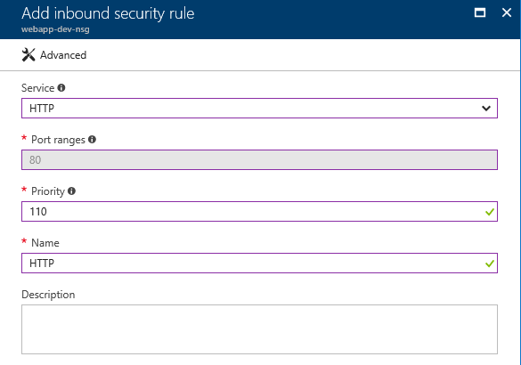
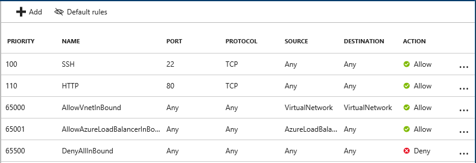
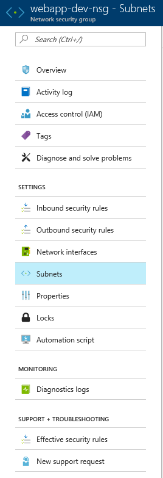
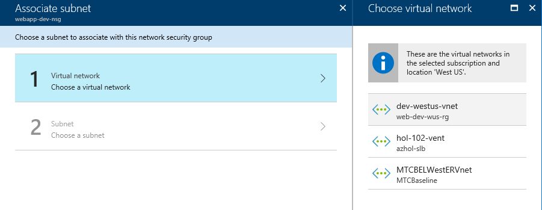
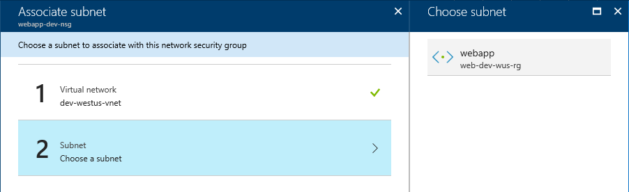
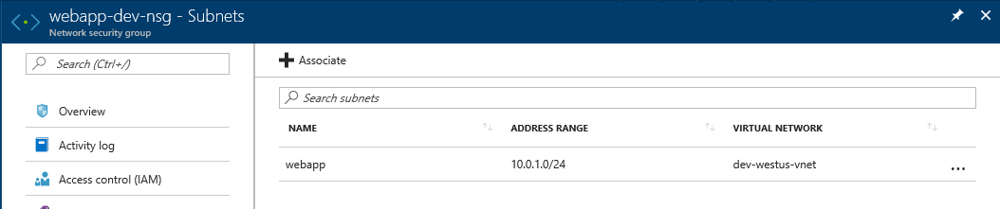

# Create Network Security Group
1. Network Security Group

    Understand how to create and manage NSG rules.
    Use following names for this lab.

    |Name|Subscription|Resource Group|Location|
    |---|---|---|---|
    |webapp-dev-nsg|*yoursubscription*|*yourresourcegroup*|West US| 

1. Add Inbound Security Rules
    1. Open SSH port

    Click 'Inbound security rules' at the Settings. Click *Add*.
    And select *SSH* from 'Service' combo box. 
    Leave *Priority* as default which is 100.
    > If you don't see 'Service' combo box, please click *Basic* to change basic mode.

    

    2. Open HTTP port

    Click 'Inbound security rules' from Settings. Click *Add*.
    And select *HTTP* from 'Service' combo box. 
    This time modify *Priority* as 110. Because the Priority can't be overlaped within a NSG.
    > If you don't see 'Service' combo box, please click *Basic* to change basic mode.

    

    3. Check current status NSG rules.

    

1. Apply the rule to Subnet

    1. Click 'Subnets' at the Setting.    

    

    2. Click *+ Associate*.

    3. Click *1. Virtual Netowkr* and select *dev-westus-vnet*

    

    4. Click *2. subnet* and select *    

    

    5. Click *Okay*.

    6. You will see the NSG is associated with subnet.

    

