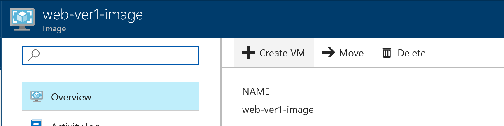
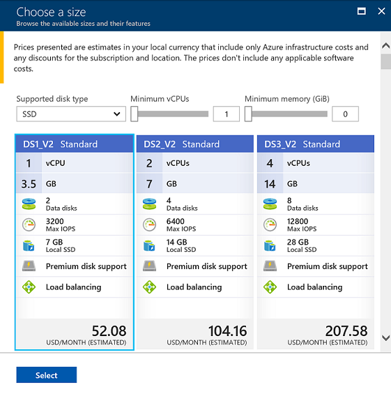
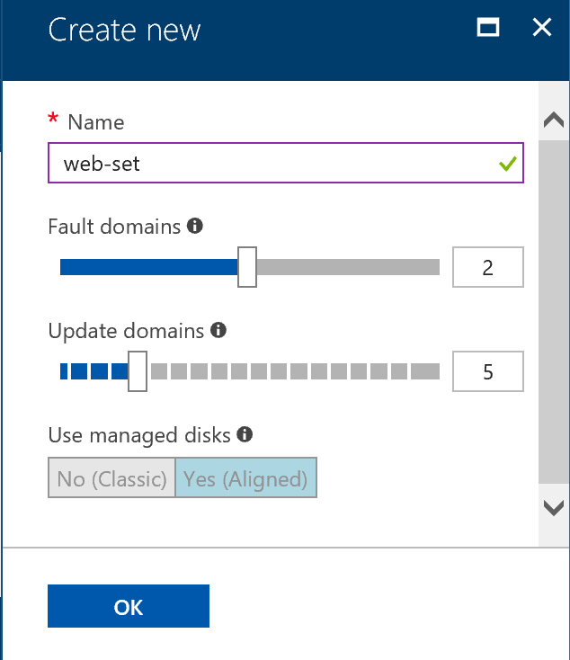
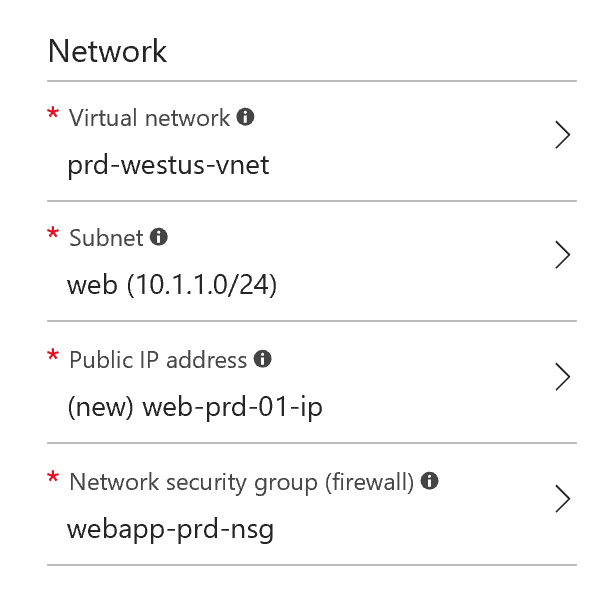

# Create VM from customized VM image from portal
Provison a new web server for production service.

## Architecture 


## Create new Virtual Network
Before create a VM, create new Virtual Network and subnet for __production webapp__. This time we'll use Cli to create Virtual Network. Launch [Cloud Shell](https://docs.microsoft.com/en-us/azure/cloud-shell/quickstart).

> To run Cloud Shell, click icon , on top of the Azure portal.

> Before run vnet creation command, modify resource group name variable.

    rgName=typeyourresourcegruopnameandrun

Run following command to create new Virtual Network and subnet. 
```bash
vnetName=prd-westus-vnet
subName=web
az network vnet create -g $rgName -n $vnetName --address-prefix '10.1.0.0/16' --subnet-name $subName --subnet-prefix '10.1.1.0/24' 
```

## Create and apply new NSG
Create new NGS for prodcution webapp VM. The new NGS will allow only TCP 80 port (HTTP). TCP 22 port (SSH) will be denied.

1. Create new NSG
```bash
nsgName=webapp-prd-nsg
az network nsg create -g $rgName -n $nsgName
```

2. Set new rule
```bash
az network nsg rule create -g $rgName --nsg-name $nsgName --direction Inbound -n HTTP --priority 110 --source-address-prefixes '*' --source-port-ranges '*' --destination-address-prefixes '*' --destination-port-ranges 80 --access allow --protocol Tcp
```

3. Apply NSG to subnet
```bash
az network vnet subnet update -g $rgName -n $subName --vnet-name $vnetName --network-security-group $nsgName
```

## Create VM 

1. Create VM from the customized image. Click the image. 
> If you can't find it, use search in the top of portal.


2. Click '+ Create VM'.



3. Please use below table to fillout the form.

    |Name|VM Disk Type|User Name|Authentication Type|Password|Subscription|Resource Group|Location|
    |---|---|---|---|---|---|---|---|
    |web-prd-01|SSD|azureadmin|Password|P@ssword1234|*yoursubscription*|*yourresourcegroup*|West US|

4. Choose VM size



5. Settings for VM
    * High Availability

        This time we are going to create new High Availability set for the production web server.

        - Create new availability set

            |Availability Zone|Availability Set|
            |---|---|
            |None|web-set|

            

    * Network
        - Choose prodcution virtual network, subnet and NSG 

        

    * Extensions
        - Leave it as default (none).

    * Auto-Shutdown
        - Leave is as default, 'Off'.
    * Monitoring
        - Disable both 'Boot diagnostics' and 'Guest OS diagnostics'.
        
        

8. Review summary and Click 'Create'.

---

[Next Lab 5.>>](https://github.com/xlegend1024/az-infra-wrkshp-101/tree/master/3.%20Hands%20on%20Labs/3.5.%20Create%20VM%20Cli)