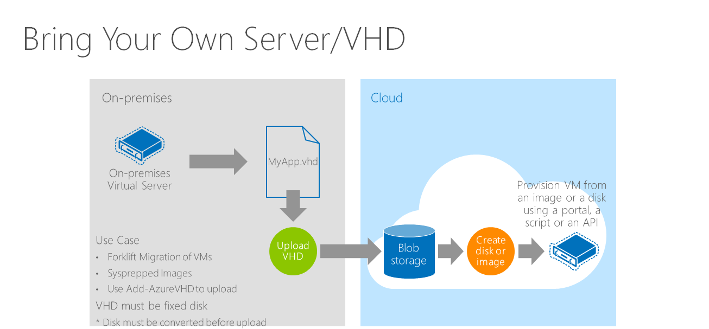

# Create VM from customized VM image using Azure Cli
During the labs, we are going to use [Azure Cloud Shell](https://docs.microsoft.com/en-us/azure/cloud-shell/overview) and  [Azure cli](https://azure.github.io/projects/clis/).

## Architecture 


## VM Migration
If you have your own images in your on-premise environment, you can upload your image to cloud and run. 



> Note that there are few conditions you need to verify to run your own vm on Azure. You can see detail conditions from the [link](https://docs.microsoft.com/en-us/azure/virtual-machines/linux/create-upload-generic).

1. Find Blob storage account name

    Before upload VM image, create storage account first. The storage account should be unique. You can find unique name by running below command.

```bash
blobName=changeblobname
az storage account check-name --name $blobName
```
2. Create Blob storage account and container

    Container in a Blob stroage account will be a directory wher your files wil be stored. Following command will create new blob storage account and new container. 
    
```bash
az storage account create -g $rgName -n $blobName --sku Standard_LRS
blobConn=$(az storage account show-connection-string --resource-group $rgName --name $blobName  --output tsv)
az storage container create -n vhds --connection-string $blobConn
```

3. Move/Copy VHD

    Copy VM image from on-premise to azure blob. And to copy VHD file, [azcopy](https://docs.microsoft.com/en-us/azure/storage/common/storage-use-azcopy-linux?toc=%2fazure%2fstorage%2fblobs%2ftoc.json) will be used. 

> VHD is already prepared for the hands on lab. To understand how to prepare VHD for Azure Migration visit [link](https://docs.microsoft.com/en-us/azure/virtual-machines/linux/create-upload-generic).

```bash
blobKey=$(az storage account keys list -g $rgName -n $blobName --query [].[value][0] --output tsv)
azcopy --source:https://workshopiaasmtcseagp.blob.core.windows.net/vhds/ --source-key "9cAiVFEmnOXJ/gYQ1DDOrtjrQDN1CevGQ3OfX+sL/QMoMPaZ2ti3zUy2Od60wAmYcNp4nlMQ872HSPnPLOaYhg==" \
    --destination https://$blobName.blob.core.windows.net/vhds/ --dest-key $blobKey \
    --include "iaaslablinuxvm20171024162330.vhd"
```

> To complete copy a VHD from blob to blob will take around 3~4 mintues.

3. Create a managed disk using uploaded VHD file

    Currently the uploaded VHD file is simple file ojbect that stored on Azure Blob storage. The VHD file should be registered as a disk to be registered as a VM image. By running below command, you are going to point the blob file as a managed disk.

```bash
az storage blob list --container-name vhds --connection-string $blobConn --output table
blobURL=$(az storage blob url --container-name vhds --name "iaaslablinuxvm20171024162330.vhd" --connection-string $blobConn --output tsv)
az disk create -g $rgName --name "web-ubt-os-disk" --sku Premium_LRS --source $blobURL
```

4. Create Image from managed disk 

    To create multiple VMs by using uploaded VHD, the managed disk should be registered as an image. By running below command, you are able to create multiple VMs from the image.

```bash
az image create -g $rgName -n "migrated-web-ubt-img" --source "web-ubt-os-disk" --os-type linux
```

5. Create a VM using customized VM

    Create a VM using cli.   

> To run following command make sure following resources are already existing.
```bash
vnetName=prd-westus-vnet
subName=web
nsgName=webapp-prd-nsg
```

```bash
az vm create --resource-group $rgName --name "web-prd-02" --image "migrated-web-ubt-img" \
    --admin-username "azureadmin" \
    --admin-password "P@ssword1234" \
    --availability-set "web-set" \
    --vnet-name $vnetName \
    --subnet $subName \
    --nsg $nsgName
```

---

[Next Lab 6.>>](https://github.com/xlegend1024/az-infra-wrkshp-101/tree/master/3.%20Hands%20on%20Labs/3.6.%20Application%20Gateway)