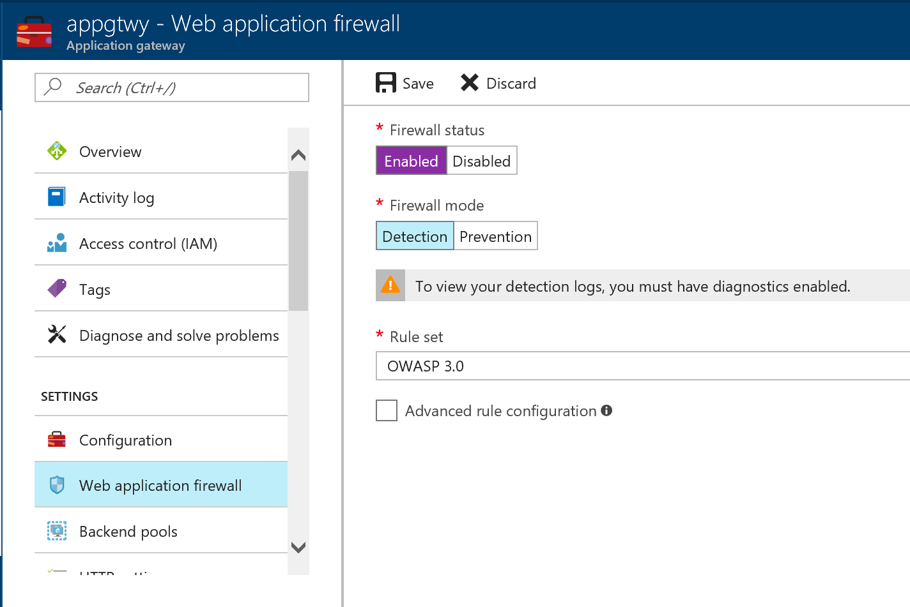

# Create Application Gateway for Webapp
Create new subnet before provision production webapp. Launch [Cloud Shell](https://docs.microsoft.com/en-us/azure/cloud-shell/quickstart) for this lab.

> Before run next command, modify resource group name first.
> If a resource is not exits with following name, you'll see an error.
```bash
rgName=typeyourresourcegruopnameandrun
vnetName=prd-westus-vnet
subName=appgtwy
nsgName=webapp-prd-nsg
```

1. Create Application Gateway

Run below command in the Cloud Shell to create Application Gateway.

```bash
az network vnet subnet create -g $rgName -n $subName --vnet-name $vnetName --address-prefix 10.1.101.0/24 --network-security-group $nsgName

az network application-gateway create -g $rgName -n "l7slb" \
    --capacity 2 --sku WAF_Medium \
    --vnet-name $vnetName \
    --subnet $subName \
    --frontend-port 80 \
    --public-ip-address "httpslb-ip"     
```

2. Add backend pool. 
Add web servers to Application Gateway.

```bash
az network application-gateway address-pool create -g $rgName --gateway-name "l7slb" -n "webpool" --servers 10.1.1.4 10.1.1.5
```

3. Enable WAF (Web Application Firewall)
To protect your web and servers, enalbe WAF feature of Application Gateway.




4. Access your web server 
Now you can access your webapp via Application Gateway Public IP address.
